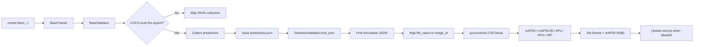

<div align="center">

# CDP-train

### A modified Ultralytics YOLO training fork for COCO-style validation, COCO fitness, and reproducible visualization.

<p>
  <a href="https://github.com/Sihang-Geng/CDP-train/blob/main/LICENSE"></a>
  
  
  
  
</p>

<p>
  <b>Training-time COCO API evaluation</b> |
  <b>mAP50-95 fitness</b> |
  <b>custom COCO JSON lookup</b> |
  <b>visualization scripts</b>
</p>

</div>

> **Notice**
> This repository is a personal modified fork of [Ultralytics](https://github.com/ultralytics/ultralytics). It is not an official Ultralytics repository. The original Ultralytics copyright notices and the GNU AGPL-3.0 license are retained.

## Overview

`CDP-train` focuses on a practical training problem: when a detection dataset is stored with COCO-style annotation JSON, the model selection process should be able to use the same COCO API metrics that are used for final evaluation.

This fork modifies the Ultralytics YOLO training and validation path so that training-time validation can:

- collect prediction JSON during selected epochs,
- evaluate with `pycocotools.COCOeval`,
- write COCO mAP metrics back into the training stats,
- use `metrics/mAP50-95(B)` as the `fitness` signal for `best.pt`,
- support custom annotation JSON locations and non-numeric image names,
- keep visualization and plotting scripts in the open-source release.

The goal is not to replace the Ultralytics project. The goal is to make one research-oriented training workflow easier to reproduce, inspect, and extend.

## What Changed

| Area | Main change | Why it matters |
| --- | --- | --- |
| Training loop | Adds COCO fitness controls to `BaseTrainer` | Makes `best.pt` follow COCO mAP instead of a mismatched internal metric. |
| Validation loop | Runs COCO evaluation only on selected epochs | Reduces JSON and COCO API overhead during long training runs. |
| Detection validator | Uses `pycocotools` and custom annotation lookup | Supports custom COCO-format datasets outside the standard COCO directory layout. |
| Image ID handling | Maps `file_name` to `image_id` from annotation JSON | Prevents wrong COCO evaluation when image filenames are not numeric IDs. |
| Optimizer path | Falls back from `MuSGD` to standard `SGD` | Avoids training failure when custom optimizer dependencies are unavailable. |
| Documentation | Adds project README and technical notes | Makes the fork understandable as a standalone open-source project. |
| Examples | Includes training, COCO test, plotting, and visualization scripts | Shows how the modified workflow is used in practice. |

## Training Pipeline



## Core Parameters

The fork adds the following configuration fields in [`ultralytics/cfg/default.yaml`](ultralytics/cfg/default.yaml):

```yaml
use_coco_fitness: False
coco_eval_interval: 1
coco_only_best: False
coco_start_epoch: 0
```

| Parameter | Recommended use | Meaning |
| --- | --- | --- |
| `save_json=True` | Required for COCO API evaluation | Enables prediction collection for `predictions.json`. |
| `use_coco_fitness=True` | Enable when COCO mAP should drive model selection | Turns on training-time COCO evaluation logic. |
| `coco_eval_interval=5` or `10` | Useful for long training | Runs COCO API every N epochs instead of every epoch. |
| `coco_only_best=True` | Recommended with interval evaluation | Prevents non-COCO epochs from overwriting `best.pt`. |
| `coco_start_epoch=100` | Useful for warmup-heavy training | Skips expensive COCO API calls in early epochs. |

## Quick Start

Install the project in editable mode:

```bash
pip install -e .
```

Install COCO evaluation support:

```bash
pip install pycocotools
```

Run the included training example after adapting paths for your environment:

```bash
python ultralytics/train.py
```

Minimal training example:

```python
from ultralytics import YOLO

model = YOLO("/root/ultralytics/ultralytics/cfg/models/v8/yolov8s.yaml")

results = model.train(
    data="/root/ultralytics/ultralytics/cfg/datasets/RUOD/RUOD_YOLO/data.yaml",
    epochs=250,
    imgsz=640,
    seed=0,
    deterministic=True,
    save_json=True,
    use_coco_fitness=True,
    coco_eval_interval=10,
    coco_only_best=True,
    coco_start_epoch=100,
    patience=100,
)

results = model.val()
```

## COCO Annotation Lookup

For custom datasets, [`ultralytics/models/yolo/detect/val.py`](ultralytics/models/yolo/detect/val.py) searches several common annotation locations:

```text
{data_path}/instances_val2017.json
{data_path}/annotations/instances_val2017.json
{data_path}/annotations/instances_val.json
{data_path}/annotations/instances_{split}.json
{data_path}/val/_annotations.coco.json
{data_path}/instances_val.json
{data_path}/_annotations.coco.json
```

This is useful when a dataset is exported from a custom labeling platform or has a COCO-like layout that is not identical to the official COCO folder structure.

## Image ID Mapping

COCO prediction records must use the same `image_id` values as the ground-truth JSON. The modified validator reads `images[].file_name` and `images[].id` from the annotation file and builds a lookup table:

```python
self.img_id_map[Path(img["file_name"]).name] = img["id"]
self.img_id_map[Path(img["file_name"]).stem] = img["id"]
```

During `pred_to_json()`, the prediction writer uses this map first, then falls back to the original filename-stem logic. This avoids evaluation errors when validation images have names like `ship_0001.jpg` or exported filenames that are not numeric COCO IDs.

## Repository Map

| File | Role |
| --- | --- |
| [`ultralytics/engine/trainer.py`](ultralytics/engine/trainer.py) | COCO fitness defaults, resume parameter handling, `best.pt` update control, SGD fallback. |
| [`ultralytics/engine/validator.py`](ultralytics/engine/validator.py) | Epoch-level COCO scheduling, prediction JSON writing, training-time `eval_json()` calls. |
| [`ultralytics/models/yolo/detect/val.py`](ultralytics/models/yolo/detect/val.py) | Custom annotation lookup, image ID mapping, `pycocotools.COCOeval` metric writing. |
| [`ultralytics/cfg/default.yaml`](ultralytics/cfg/default.yaml) | New COCO fitness configuration fields. |
| [`ultralytics/train.py`](ultralytics/train.py) | Main training example used by this fork. |
| [`coco-test.py`](coco-test.py) | COCO-related test script. |
| [`visual.py`](visual.py) | Visualization script. |
| [`ultralytics/plotfig2.py`](ultralytics/plotfig2.py) | Plotting script for result visualization. |
| [`ultralytics/3d.py`](ultralytics/3d.py) | 3D/visualization helper script. |
| [Change notes](ultralytics/%E6%9B%B4%E6%94%B9%E8%AF%B4%E6%98%8E.md) | Detailed technical change notes. |

## Recommended Training Modes

### Full COCO-driven model selection

Use this when final model quality should be selected by COCO mAP:

```python
model.train(
    save_json=True,
    use_coco_fitness=True,
    coco_eval_interval=10,
    coco_only_best=True,
    coco_start_epoch=100,
)
```

### Fast debugging

Use this when you only want to confirm the training pipeline works:

```python
model.train(
    save_json=False,
    use_coco_fitness=False,
)
```

## Technical Notes

<details>
<summary><b>How fitness is selected</b></summary>

When COCO evaluation is enabled and runs successfully, `metrics/mAP50-95(B)` is written back to the validation stats. The trainer reads this value as `fitness`. If `coco_only_best=True`, epochs that skip COCO evaluation are assigned `-inf` fitness so they cannot replace the COCO-selected `best.pt`.

</details>

<details>
<summary><b>Why COCO evaluation is scheduled</b></summary>

COCO API evaluation is more expensive than normal validation because it requires prediction collection, JSON writing, annotation loading, and full COCOeval accumulation. `coco_eval_interval` and `coco_start_epoch` reduce this overhead while keeping final model selection aligned with COCO metrics.

</details>

<details>
<summary><b>What happens without pycocotools</b></summary>

If `pycocotools` is not installed, the validator prints a warning and skips COCO API evaluation instead of crashing the training process. Install it with `pip install pycocotools` when COCO metrics are required.

</details>

## Visualization Gallery

The repository includes visualization and plotting scripts, and the following images are kept as example outputs.

<table>
  <tr>
    <td align="center" width="50%">
      
      <br>
      <sub>Example 1</sub>
    </td>
    <td align="center" width="50%">
      
      <br>
      <sub>Example 2</sub>
    </td>
  </tr>
</table>

## License

This project is released under the GNU AGPL-3.0 license inherited from Ultralytics. See [LICENSE](LICENSE).

Upstream project: [ultralytics/ultralytics](https://github.com/ultralytics/ultralytics)
