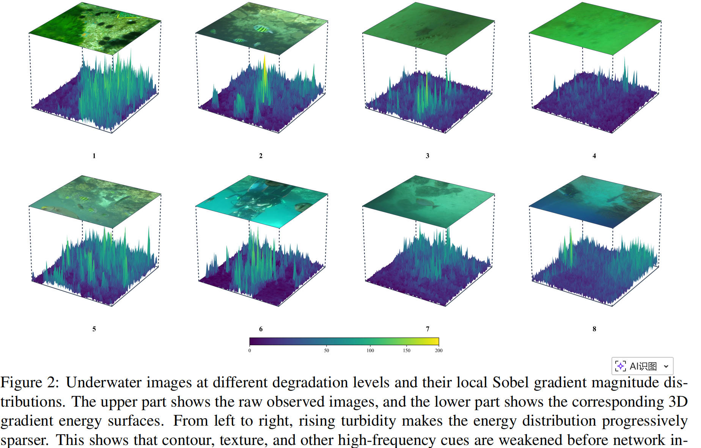
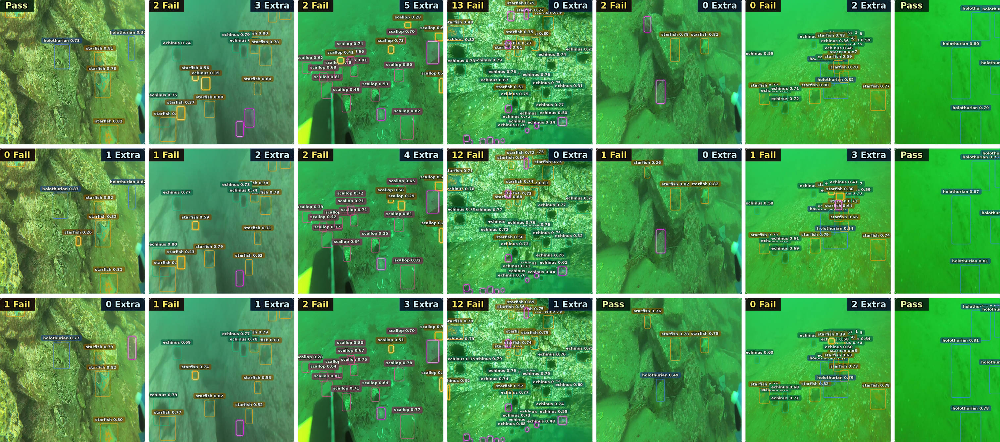

<div align="center">

# CDP-train

### AP-aligned training and evaluation utilities for Ultralytics YOLO research workflows.

<p>
  <a href="https://github.com/Sihang-Geng/CDP-train/blob/main/LICENSE"></a>
  
  
  
  
</p>

<p>
  <b>AP-aligned model selection</b> |
  <b>training-time COCO evaluation</b> |
  <b>custom COCO annotation support</b> |
  <b>paper-style visualization scripts</b>
</p>

</div>

> **Notice**
> This repository is a personal modified fork of [Ultralytics](https://github.com/ultralytics/ultralytics), not an official Ultralytics repository. The upstream copyright notices and the GNU AGPL-3.0 license are retained.

## Motivation

In object detection research, final results are commonly reported with COCO-style AP metrics, especially `AP@[.50:.95]` / `mAP50-95`. This creates a practical gap during experimentation: the checkpoint selected during training should ideally be selected by the same metric family that will be reported in the paper.

The original Ultralytics training workflow is strong and convenient, but in custom research settings the training-time fitness signal may not be fully aligned with the final COCO AP evaluation protocol. This repository addresses that gap by adding an AP-aligned training/evaluation path on top of Ultralytics YOLO.

In short, `CDP-train` is designed to answer a very specific research-engineering question:

> If the paper reports COCO AP, can the training process select `best.pt` using COCO AP as well?

This repository opens the non-core training, evaluation, and visualization support code from an ongoing manuscript. The full research method is not released here because the paper has not been formally accepted yet.

## What This Repository Solves

| Research workflow problem | What this repository provides |
| --- | --- |
| Final papers report COCO AP, but training may select checkpoints with a different fitness signal. | Uses COCO `mAP50-95(B)` as the training fitness for `best.pt`. |
| Running full COCO API every epoch is expensive. | Adds scheduled evaluation with `coco_eval_interval` and `coco_start_epoch`. |
| Custom COCO-format datasets often do not follow official COCO folder naming. | Searches multiple common annotation JSON locations. |
| Custom image names may not be numeric COCO IDs. | Reads `images[].file_name` and `images[].id` from annotation JSON for reliable `image_id` mapping. |
| Reproducing paper figures requires more than training code. | Includes plotting and visualization scripts with example outputs. |
| Some environments do not include custom optimizer dependencies. | Falls back from `MuSGD` to standard `torch.optim.SGD`. |

## Figure 8: Plotting Script Output

The figure below is an example produced by the released plotting code. It is placed here intentionally: the repository includes not only training modifications, but also the figure-generation utilities used around the research workflow.

<p align="center">
  
</p>

<p align="center">
  <sub><b>Fig. 8.</b> Example output from the released paper-style plotting utilities.</sub>
</p>

## Released Scope

This is a partial research-code release. The goal is to make the training and evaluation support code inspectable while keeping unpublished core method details outside the repository.

| Component | Status | Notes |
| --- | --- | --- |
| AP-aligned checkpoint selection | Released | Uses COCO `mAP50-95(B)` as training fitness. |
| Training-time COCO API evaluation | Released | Runs `pycocotools.COCOeval` during selected validation epochs. |
| Custom COCO annotation lookup | Released | Supports multiple common JSON layouts. |
| Annotation-based image ID mapping | Released | Aligns prediction `image_id` with ground-truth COCO JSON. |
| Visualization and plotting scripts | Released | Includes qualitative and paper-style figure utilities. |
| Complete unpublished method | Not released | Reserved until the manuscript is formally accepted. |

## Main Features

### 1. AP-aligned `best.pt` selection

The central modification is to make checkpoint selection follow COCO `mAP50-95(B)`. When COCO evaluation is executed successfully, the validator writes `metrics/mAP50-95(B)` back into the training stats and uses it as `fitness`.

This makes model selection closer to the metric used in paper reporting.

### 2. Scheduled COCO evaluation during training

Full COCO evaluation requires prediction collection, JSON export, annotation loading, and COCOeval accumulation. To keep training efficient, the repository adds scheduling controls:

```yaml
use_coco_fitness: False
coco_eval_interval: 1
coco_only_best: False
coco_start_epoch: 0
```

| Parameter | Purpose |
| --- | --- |
| `use_coco_fitness` | Enables AP-aligned COCO fitness during training. |
| `coco_eval_interval` | Runs COCO API every N epochs instead of every epoch. |
| `coco_only_best` | Prevents non-COCO epochs from updating `best.pt`. |
| `coco_start_epoch` | Skips early COCO evaluation to reduce warmup-stage overhead. |

### 3. Custom COCO JSON support

The modified detection validator searches several common annotation locations:

```text
{data_path}/instances_val2017.json
{data_path}/annotations/instances_val2017.json
{data_path}/annotations/instances_val.json
{data_path}/annotations/instances_{split}.json
{data_path}/val/_annotations.coco.json
{data_path}/instances_val.json
{data_path}/_annotations.coco.json
```

This is useful for datasets exported from labeling platforms or arranged in COCO-like, but not official COCO-identical, directory layouts.

### 4. Annotation-based image ID mapping

COCO prediction JSON must use the same `image_id` values as the ground-truth file. The validator therefore builds an ID map from the annotation JSON:

```python
self.img_id_map[Path(img["file_name"]).name] = img["id"]
self.img_id_map[Path(img["file_name"]).stem] = img["id"]
```

This avoids incorrect AP results when validation images use names such as `ship_0001.jpg`, exported filenames, or other non-numeric identifiers.

### 5. Visualization and plotting utilities

The repository also includes scripts used for qualitative inspection and figure preparation. This is useful because research code often requires both metric-aligned training and clear visual evidence for analysis.

## Quick Start

Install the project in editable mode:

```bash
pip install -e .
```

Install COCO evaluation support:

```bash
pip install pycocotools
```

Run the included training example after adapting paths for your environment:

```bash
python ultralytics/train.py
```

Minimal training example:

```python
from ultralytics import YOLO

model = YOLO("/root/ultralytics/ultralytics/cfg/models/v8/yolov8s.yaml")

results = model.train(
    data="/root/ultralytics/ultralytics/cfg/datasets/RUOD/RUOD_YOLO/data.yaml",
    epochs=250,
    imgsz=640,
    seed=0,
    deterministic=True,
    save_json=True,
    use_coco_fitness=True,
    coco_eval_interval=10,
    coco_only_best=True,
    coco_start_epoch=100,
    patience=100,
)

results = model.val()
```

## Recommended Training Modes

### AP-aligned research training

Use this mode when the reported metric is COCO AP and checkpoint selection should follow the same protocol:

```python
model.train(
    save_json=True,
    use_coco_fitness=True,
    coco_eval_interval=10,
    coco_only_best=True,
    coco_start_epoch=100,
)
```

### Fast pipeline check

Use this mode when only checking whether training runs:

```python
model.train(
    save_json=False,
    use_coco_fitness=False,
)
```

## Qualitative Visualization Example

The following example is generated by the released visualization utilities and is intended for qualitative inspection.

<p align="center">
  
</p>

<p align="center">
  <sub><b>Qualitative example.</b> Output from the released visualization script.</sub>
</p>

## Repository Map

| File | Role |
| --- | --- |
| [`ultralytics/engine/trainer.py`](ultralytics/engine/trainer.py) | Adds AP-aligned fitness handling, resume parameter support, `best.pt` control, and SGD fallback. |
| [`ultralytics/engine/validator.py`](ultralytics/engine/validator.py) | Controls training-time JSON collection and scheduled COCO API calls. |
| [`ultralytics/models/yolo/detect/val.py`](ultralytics/models/yolo/detect/val.py) | Implements custom annotation lookup, image ID mapping, and `pycocotools.COCOeval` metric writing. |
| [`ultralytics/cfg/default.yaml`](ultralytics/cfg/default.yaml) | Defines the COCO fitness configuration fields. |
| [`ultralytics/train.py`](ultralytics/train.py) | Training entry example for this fork. |
| [`coco-test.py`](coco-test.py) | COCO-related test script. |
| [`visual.py`](visual.py) | Qualitative visualization script. |
| [`ultralytics/plotfig2.py`](ultralytics/plotfig2.py) | Paper-style plotting script. |
| [`ultralytics/3d.py`](ultralytics/3d.py) | 3D visualization helper script. |
| [Change notes](ultralytics/%E6%9B%B4%E6%94%B9%E8%AF%B4%E6%98%8E.md) | Detailed technical notes for the code changes. |

## Technical Notes

<details>
<summary><b>How fitness is selected</b></summary>

When COCO evaluation is enabled and runs successfully, `metrics/mAP50-95(B)` is written back to the validation stats. The trainer reads this value as `fitness`. If `coco_only_best=True`, epochs that skip COCO evaluation are assigned `-inf` fitness so they cannot replace the COCO-selected `best.pt`.

</details>

<details>
<summary><b>Why COCO evaluation is scheduled</b></summary>

COCO API evaluation is more expensive than normal validation because it requires prediction collection, JSON writing, annotation loading, and full COCOeval accumulation. `coco_eval_interval` and `coco_start_epoch` reduce this overhead while keeping final model selection aligned with the reported AP protocol.

</details>

<details>
<summary><b>What happens without pycocotools</b></summary>

If `pycocotools` is not installed, the validator prints a warning and skips COCO API evaluation instead of crashing the training process. Install it with `pip install pycocotools` when AP-aligned model selection is required.

</details>

## License

This project is released under the GNU AGPL-3.0 license inherited from Ultralytics. See [LICENSE](LICENSE).

Upstream project: [ultralytics/ultralytics](https://github.com/ultralytics/ultralytics)
