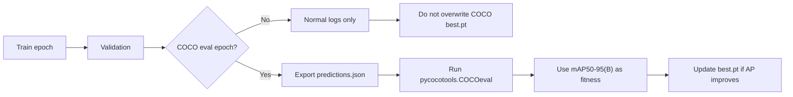

# COCO-FairTrain 🚀

**COCO AP-aligned training for fair object detection research.**

COCO-FairTrain modifies the Ultralytics training loop so `best.pt` can be selected by official COCO API AP during training, not only by the final epoch or an internal validation signal.

> Train with a fixed budget.  
> Select checkpoints with the metric you actually report. 🎯

## The Research Problem 🧪

Many papers use this protocol:

```text
train every model for N epochs -> evaluate the final checkpoint with COCO API -> compare AP
```

It looks fair, but there is a hidden trap:

| Model behavior | Final-epoch-only evaluation can do this |
| --- | --- |
| Peaks early, then overfits | Reports a degraded checkpoint 😵 |
| Peaks near the final epoch | Reports a near-best checkpoint 🙂 |
| Converges slowly | May look better simply because timing matches the protocol |
| Converges fast | May be punished for being early |

So the comparison may become:

```text
model quality + convergence timing + overfitting timing
```

instead of just:

```text
model quality
```

COCO-FairTrain is built for this exact research pain point. It keeps the same training budget, but lets the framework save the best checkpoint according to COCO `mAP50-95(B)` observed during training.

## What Changes? ⚙️



| Part | File | Main idea |
| --- | --- | --- |
| Trainer guard | [`ultralytics/engine/trainer.py`](ultralytics/engine/trainer.py) | Only COCO-evaluated epochs can replace `best.pt` when strict mode is enabled. |
| Eval scheduler | [`ultralytics/engine/validator.py`](ultralytics/engine/validator.py) | Runs COCO API every N epochs instead of every epoch. |
| COCO metrics | [`ultralytics/models/yolo/detect/val.py`](ultralytics/models/yolo/detect/val.py) | Calls `pycocotools`, writes AP metrics, and fixes custom `image_id` mapping. |
| Config switches | [`ultralytics/cfg/default.yaml`](ultralytics/cfg/default.yaml) | Adds COCO-aligned training options. |
| Full notes | [implementation notes](ultralytics/%E6%9B%B4%E6%94%B9%E8%AF%B4%E6%98%8E.md) | Detailed modification record. |

## Core Switches 🕹️

```yaml
use_coco_fitness: False
coco_eval_interval: 1
coco_only_best: False
coco_start_epoch: 0
```

| Option | Effect |
| --- | --- |
| `use_coco_fitness` | Enable training-time COCO API evaluation and use COCO AP as fitness. |
| `coco_eval_interval` | Evaluate with COCO API every N epochs. |
| `coco_only_best` | Block non-COCO epochs from updating `best.pt`. |
| `coco_start_epoch` | Skip expensive COCO API calls in early training. |

Recommended research setting:

```python
use_coco_fitness=True
coco_eval_interval=5
coco_only_best=True
coco_start_epoch=100
```

## Key Code Ideas 🔍

These snippets mirror the actual implementation described in the modification notes.

### 1. COCO evaluation is scheduled by epoch

From `ultralytics/engine/validator.py`:

```python
coco_eval_this_epoch = (
    ((trainer.epoch + 1) >= start_epoch)
    and (
        (eval_interval <= 1)
        or ((trainer.epoch + 1) % eval_interval == 0)
        or ((trainer.epoch + 1) == trainer.epochs)
    )
)

self.args.save_json = coco_eval_this_epoch
```

Why it matters: COCO API can be expensive. This runs it only when needed, while still forcing the final epoch to be evaluated.

### 2. COCO AP becomes the training fitness

From `ultralytics/engine/validator.py`:

```python
stats = self.eval_json(stats)
coco_fitness = stats.get("metrics/mAP50-95(B)")

if coco_fitness is not None:
    stats["fitness"] = coco_fitness
    stats["coco_eval"] = 1.0
```

Why it matters: the metric used for checkpoint selection is now aligned with the metric used in papers.

### 3. Non-COCO epochs cannot steal `best.pt`

From `ultralytics/engine/trainer.py`:

```python
coco_eval = metrics.pop("coco_eval", 0.0)
fitness = metrics.pop("fitness", -self.loss.detach().cpu().numpy())

if self.args.use_coco_fitness and self.args.coco_only_best and not coco_eval:
    fitness = float("-inf")

if (not self.best_fitness or self.best_fitness < fitness) and fitness > float("-inf"):
    self.best_fitness = fitness
```

Why it matters: if COCO evaluation runs every 5 epochs, the 4 ordinary validation epochs in between should not overwrite a COCO-selected checkpoint.

### 4. Custom COCO datasets get safer `image_id` mapping

From `ultralytics/models/yolo/detect/val.py`:

```python
for img in data.get("images", []):
    self.img_id_map[Path(img["file_name"]).name] = img["id"]
    self.img_id_map[Path(img["file_name"]).stem] = img["id"]
```

Why it matters: COCO prediction JSON must use the same `image_id` values as the annotation JSON. Filename-to-number conversion is often wrong for custom datasets.

## Custom Annotation Search 🗂️

The validator checks common COCO-style paths:

```text
{data_path}/instances_val2017.json
{data_path}/annotations/instances_val2017.json
{data_path}/annotations/instances_val.json
{data_path}/annotations/instances_{split}.json
{data_path}/val/_annotations.coco.json
{data_path}/instances_val.json
{data_path}/_annotations.coco.json
```

That makes the framework friendlier for exported datasets from real research pipelines.

## Quick Start ⚡

```bash
pip install -e .
pip install pycocotools
```

```python
from ultralytics import YOLO

model = YOLO("ultralytics/cfg/models/v8/yolov8s.yaml")

model.train(
    data="path/to/data.yaml",
    epochs=250,
    imgsz=640,
    save_json=True,
    use_coco_fitness=True,
    coco_eval_interval=5,
    coco_only_best=True,
    coco_start_epoch=100,
)
```

## When To Use It ✅

| Scenario | Useful? |
| --- | --- |
| Architecture comparison | ✅ |
| Ablation study | ✅ |
| Loss or training-trick comparison | ✅ |
| Custom COCO-style dataset | ✅ |
| Final-epoch-only leaderboard reproduction | Maybe not |

## Notes

- This is a personal modified fork of Ultralytics, not an official Ultralytics release.
- Upstream copyright notices and the GNU AGPL-3.0 license are retained.
- If `pycocotools` is unavailable, COCO API evaluation is skipped with a warning.
- The focus is intentionally narrow: **fair COCO AP checkpoint selection for research benchmarking**.
